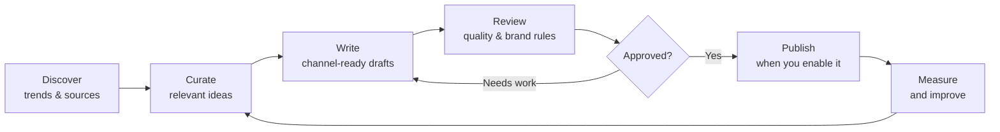

# Social Machine for All

> Your company’s self-hosted content operating system — discover ideas, create
> better posts, review them, and publish with your rules in control.

[](LICENSE)
[](https://nextjs.org/)
[](https://supabase.com/)

Social Machine for All is an open-source, self-hosted workspace for teams that
want a repeatable content engine without handing their brand, accounts, or data
to a black box. Start with approval-first workflows; turn on automation only
when your process is ready.

**Bring your own brand. Bring your own accounts. Keep control.**

## Why use it?

Most content tools solve one isolated step: ideas, writing, scheduling, or
analytics. Social Machine connects the workflow without forcing a one-size-fits-all
editorial voice.

| Instead of… | You get… |
| --- | --- |
| Hunting for ideas in multiple tabs | Monitors, source curation and trend discovery |
| Copy that sounds generic | Workspace-level voice, prompts and quality rules |
| Publishing without a review trail | Draft → review → approval → publication |
| Guessing what worked | Performance signals and evaluation history |
| A vendor owning the workflow | Your Supabase project, your deployment, your credentials |

## What happens in one run?



Every stage is visible in the dashboard and can be configured per workspace.

## Built for real content operations

- **Editorial pipeline:** monitor, curator, writer, reviewer and publisher agents.
- **Human control:** keep publishing manual, approval-based, or selectively automated.
- **Multi-channel foundation:** X, LinkedIn, Instagram, YouTube and optional video workflows.
- **Brand-adaptable:** workspace settings, agent prompts and feature flags — not a bundled company profile.
- **Quality by design:** deduplication, configurable review thresholds and evaluation data.
- **Safe starting point:** no credentials, social accounts, workspace IDs or schedules are included.

## Get running locally

You need Node.js, a Supabase project, and a Supabase Auth user. External AI and
social integrations are optional.

```bash
git clone https://github.com/luisroquette/social-machine-for-all.git
cd social-machine-for-all
cp .env.example .env.local
npm ci
npm run dev
```

Then:

1. Add your three Supabase values to `.env.local`.
2. Apply the migrations in [`supabase/migrations`](supabase/migrations).
3. Create a Supabase Auth user and sign in.
4. Open [`/onboarding`](http://localhost:3000/onboarding) to create your workspace.
5. Configure sources, voice and approval settings before enabling any integration.

For a first run, use the dashboard to create drafts and approve them manually.
That gives you the full workflow before connecting an AI provider or social account.

## Make it yours

The template is intentionally conservative. Optional capabilities are off until
you explicitly enable them in `workspace_settings`:

- `feature_instagram_image_generation`
- `feature_evergreen_content`
- `feature_seasonal_content`
- `feature_video_reels`
- `feature_branded_reel_frame`
- `feature_reel_crossposting`
- `feature_negative_ev_guardrail`
- `feature_ev_market_curation`

Set a value to `true` (or `1`) only after configuring that workflow. Your brand
voice belongs in the workspace and agent system prompts, so a fork begins as
your company — not someone else’s.

## Deployment, privacy and costs

You operate the system in your own Supabase project and deployment. Nothing is
shared with the maintainers.

- AI, video, email, analytics and social integrations may have third-party costs.
- Credentials are never bundled; only add the services you intend to use.
- Publishing and scheduled jobs remain disabled until you configure them.
- `WORKSPACE_ID` is empty by default. Never copy an ID from another installation.

Before making a fork public, run:

```bash
npm run audit:public-release
npm test
npm run build
```

See [SECURITY.md](SECURITY.md) for vulnerability reporting and
[CONTRIBUTING.md](CONTRIBUTING.md) if you want to improve the project.

## Who is this for?

Teams, agencies and builders who want to turn a content process into a system:
without giving up ownership of their workflow, data or editorial decisions.

## License

Released under the [MIT License](LICENSE). Use it, adapt it and ship it for your
own company.
