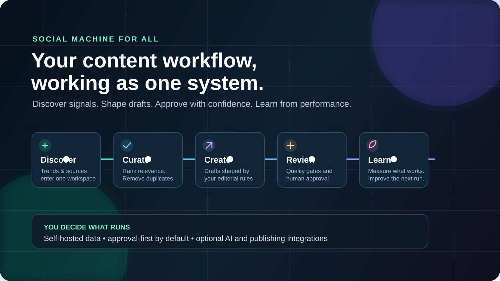
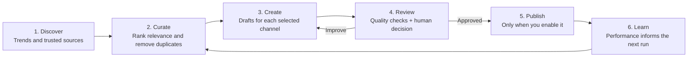
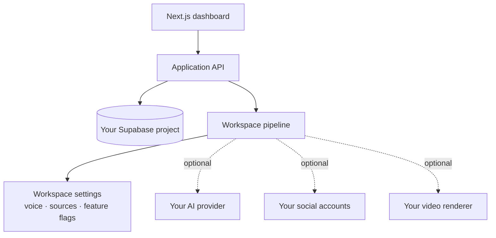

<p align="center">
  
</p>

<p align="center">
  <a href="https://github.com/luisroquette/social-machine-for-all/actions/workflows/ci.yml"></a>
  <a href="https://github.com/luisroquette/social-machine-for-all/releases/latest"></a>
  <a href="LICENSE"></a>
  
  
  
  
</p>

<h1 align="center">Social Machine for All</h1>

<p align="center"><strong>Turn content operations into a system your team actually controls.</strong></p>

<p align="center">
  Discover relevant signals, turn them into on-brand drafts, review with confidence,
  publish deliberately and learn from the result — all inside your own deployment.
</p>

<p align="center">
  <a href="#quick-start"><strong>Get started</strong></a> ·
  <a href="#how-it-works"><strong>See the workflow</strong></a> ·
  <a href="#what-you-control"><strong>What you control</strong></a> ·
  <a href="CONTRIBUTING.md"><strong>Contribute</strong></a>
</p>

---

## The idea in 30 seconds

Content teams do not need another prompt box. They need a repeatable operating
loop: **signals in, decisions visible, quality protected, learning retained**.

Social Machine is an open-source, self-hosted workspace that connects that loop.
It starts safely with human approval. When your process is ready, you can turn on
the integrations and automations that make sense for your company.

> Your data, credentials, editorial rules and publishing decisions stay in your
> infrastructure. There is no bundled customer, account or hidden workspace.

## Product tour

<p align="center">
  
</p>

<p align="center"><em>Illustrative workflow preview. The counters demonstrate state transitions, not claimed customer results.</em></p>

<p align="center">
  <a href="assets/social-machine-demo.mp4"><strong>▶ Watch the 13-second workflow video</strong></a>
</p>

Watch a signal move through curation, drafting, quality review and approval.
Nothing is published merely because an AI generated it: the workspace owns the
rules and the final decision.

> **Like the direction?** Star the repository so more teams can find it, then
> fork it to build your own content operation.

## Table of contents

- [Who this is for](#who-this-is-for)
- [How it works](#how-it-works)
- [What you get](#what-you-get)
- [Compared with fragmented workflows](#compared-with-fragmented-workflows)
- [What you control](#what-you-control)
- [Requirements](#requirements)
- [Quick start](#quick-start)
- [A practical first week](#a-practical-first-week)
- [Example pipeline record](#example-pipeline-record)
- [Architecture](#architecture)
- [Costs and safety](#costs-and-safety)
- [Current limitations](#current-limitations)
- [FAQ](#faq)
- [Contributing](#contributing)

## Who this is for

| If you are… | Social Machine helps you… |
| --- | --- |
| **An in-house content team** | Make the editorial process repeatable without losing approval control. |
| **An agency** | Give each client a separate workspace, voice and operating rules. |
| **A founder or marketer** | Move from scattered ideas to a visible queue of reviewed drafts. |
| **A builder** | Extend an open system instead of rebuilding monitoring, review and publishing plumbing. |

It is not a “post everything automatically” tool. It is a content operating
system for teams that care about quality, traceability and control.

## How it works



<p align="center"><em>One loop. One workspace. Clear decisions at every step.</em></p>

### What makes the loop useful

- **Discovery is not random:** monitor sources and trends, then rank candidates.
- **Creation is not detached from context:** drafts carry the source and workspace rules forward.
- **Approval is not an afterthought:** review is a stage, not a checkbox added after publishing.
- **Automation is earned:** start manually; enable publishing, video, or AI modules only when ready.
- **Learning is retained:** evaluation and performance data stay with the workspace.

## What you get

| Capability | What it means in practice |
| --- | --- |
| **Content pipeline** | Monitor, curator, writer, reviewer and publisher stages in one workflow. |
| **Editorial control** | Configurable prompts, thresholds, deduplication and approval gates per workspace. |
| **Multi-channel foundation** | X, LinkedIn, Instagram, YouTube and optional video workflows. |
| **Workspace isolation** | Brand configuration, accounts and settings belong to the workspace that owns them. |
| **Operational visibility** | Dashboard views for pipeline activity, drafts, evaluations and configuration. |
| **Safe extensibility** | Optional modules stay off by default; contribute your own integrations cleanly. |

## Compared with fragmented workflows

| | Spreadsheets + prompts | Basic scheduler | Social Machine |
| --- | --- | --- | --- |
| Source context survives to the draft | Depends on the operator | Usually no | Yes |
| Duplicate detection | Manual | Limited | Built into curation |
| Workspace-specific voice and rules | Copied between prompts | Template-level | Workspace-level |
| Review state and feedback history | Scattered | Basic approval | First-class pipeline stage |
| Publishing | Separate tool | Core feature | Optional final stage |
| Performance feeds the next run | Manual analysis | Dashboard only | Evaluation loop |
| Data location | Many vendors | Vendor cloud | Your Supabase project |

Social Machine is most valuable when the problem is not “schedule this post,”
but “make the entire content decision process repeatable.”

## What you control

This is the difference between installing software and adopting someone else’s
content strategy.

```text
YOU OWN                              THE TEMPLATE PROVIDES
────────                              ─────────────────────
Your Supabase project                The workflow foundation
Your social accounts                 Configurable pipeline stages
Your editorial voice                 Review, dedup and safety mechanisms
Your AI provider choices             Optional integration adapters
Your publishing policy               A dashboard and extensible codebase
Your deployment                      MIT-licensed source code
```

No social account, token, workspace ID, deployment or scheduled job is bundled.

## Requirements

- Node.js 20.9 or newer and npm 10+
- A Supabase project and the Supabase CLI
- Git
- An AI provider key only when you are ready to generate content

You can install and explore the workspace without connecting social accounts,
video rendering, analytics or email services.

## Quick start

### 1. Clone and install

```bash
git clone https://github.com/luisroquette/social-machine-for-all.git
cd social-machine-for-all
cp .env.example .env.local
npm ci
```

### 2. Connect your own database

Create a Supabase project and copy its URL, anon key and service-role key into
`.env.local`. Never expose the service-role key in browser code.

Then apply the included migrations:

```bash
npx supabase@latest login
npx supabase@latest init
npx supabase@latest link --project-ref YOUR_PROJECT_REF
npx supabase@latest db push
```

### 3. Create the local security secrets

Generate two different values and add them to `CRON_SECRET` and
`TELEGRAM_WEBHOOK_SECRET` in `.env.local`:

```bash
openssl rand -hex 32
openssl rand -hex 32
```

### 4. Start and create your workspace

Create a user in **Supabase → Authentication → Users**, then run:

```bash
npm run dev
```

Open [`http://localhost:3000/login`](http://localhost:3000/login), sign in and
continue to [`/onboarding`](http://localhost:3000/onboarding). Add your company
name, description and topics.

### 5. Run the safe path first

Configure sources and create drafts. Review them manually. Only then connect an
AI provider, social account, publishing integration or schedule.

For production, copy the same environment variables to your hosting provider,
set `APP_BASE_URL` to the public URL and keep every optional integration disabled
until its credentials and review flow are ready.

## A practical first week

| Day | Outcome |
| --- | --- |
| **Day 1** | One workspace, your voice, your topics, no publishing enabled. |
| **Day 2** | A curated queue of relevant ideas instead of an empty calendar. |
| **Day 3** | Drafts moving through your review rules. |
| **Day 4** | Approval flow calibrated with your team’s feedback. |
| **Day 5+** | Enable only the integrations that your process has earned. |

This sequencing is deliberate: quality and control come before volume.

## Example pipeline record

Every draft remains connected to an operational trail. A simplified record looks
like this:

```json
{
  "workspace": "your-company",
  "source": {
    "url": "https://example.com/source",
    "captured_at": "2026-01-15T12:00:00Z"
  },
  "curation": {
    "relevance_score": 82,
    "duplicate": false
  },
  "draft": {
    "channel": "linkedin",
    "status": "in_review"
  },
  "review": {
    "quality_score": 8.4,
    "decision": "approve"
  }
}
```

The exact database model is richer, but the principle is simple: the system
keeps the source, decision and result connected.

## Architecture



The optional edges are intentionally optional. A useful first installation does
not require every provider or every automation.

## Make it your own

Capabilities are enabled per workspace through `workspace_settings`:

- `feature_instagram_image_generation`
- `feature_evergreen_content`
- `feature_seasonal_content`
- `feature_video_reels`
- `feature_branded_reel_frame`
- `feature_reel_crossposting`
- `feature_negative_ev_guardrail`
- `feature_ev_market_curation`

Set a value to `true` (or `1`) only after the corresponding editorial and
technical setup is ready. Put your voice in workspace and agent system prompts.

The generic pipeline also includes a disabled-by-default EV/Brazil vertical as a
complete reference implementation. Its modules live under `src/lib/brand` and
the `*-brand` routes. Keep it as an example, replace its vocabulary and policies
for your market, or remove it if your company does not need that vertical.

## Costs and safety

- The core template is [MIT licensed](LICENSE).
- AI, social, video, analytics and email services can have third-party costs.
- Publishing and scheduled jobs are disabled until you deliberately configure them.
- `WORKSPACE_ID` is empty by default. Never reuse one from another installation.
- Before publishing a fork, run:

```bash
npm run audit:public-release
npm run audit:runtime
npm test
npm run build
```

Read [SECURITY.md](SECURITY.md) before reporting a vulnerability.

## Current limitations

- This is a self-hosted engineering project, not a managed SaaS service.
- Setup currently expects comfort with Node.js, Supabase and environment variables.
- Social platform APIs can require app review and can change independently of this repository.
- Advanced video workflows require a separately configured renderer.
- There is no bundled AI credit, social account, demo data or production support contract.

These constraints are explicit so teams can evaluate the project before investing
in an integration.

## FAQ

### Does it publish automatically after installation?

No. Publishing and scheduled jobs are disabled until you deliberately configure
and enable them.

### Do I need every AI provider listed in the project?

No. Providers are optional. Add only the credentials for the workflow you choose
to enable.

### Can an agency use it for multiple companies?

Yes. The architecture is workspace-based. Settings, brand context and owned
resources are resolved for the active workspace.

### Where does the data live?

In the Supabase project you configure. The maintainers do not receive your
workspace content or credentials.

### Is it free?

The source code is MIT licensed. Your hosting, database, AI provider, video
renderer and social platform usage may have separate costs.

### Can I replace the default editorial logic?

Yes. Adapt workspace settings, agent prompts, platform configuration and optional
feature flags without relying on a hard-coded company profile.

## Contributing

The best contributions make the system more reusable: better onboarding, safer
defaults, new optional adapters, accessibility improvements and clearer docs.

Read [CONTRIBUTING.md](CONTRIBUTING.md) before opening a pull request. Keep every
contribution brand-neutral and never include credentials, customer content,
account handles or workspace IDs.

## License

MIT — use it, adapt it and build the content operation your company needs.

If Social Machine helps your team, star the repository and share what you build.
